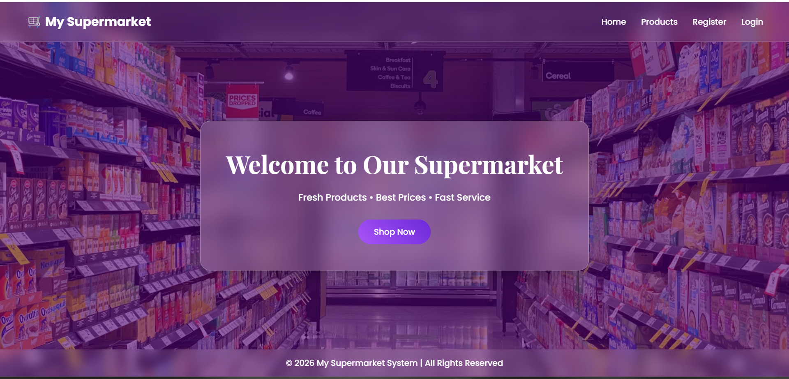
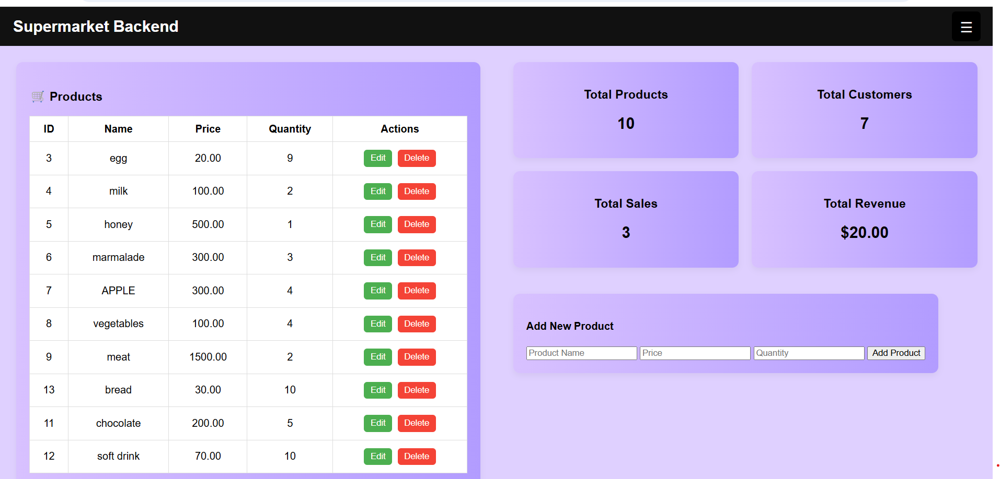

# Supermarket Management System 🛒

A web-based application to manage supermarket inventory and sales.

## 📸 Project Preview
### Login Page

### Admin Dashboard

## 🛠️ Tech Stack
* **Frontend:** HTML5, CSS3, JavaScript
* **Backend:** PHP
* **Database:** MySQL (WAMP Server)

## ⚙️ Installation
1. Move project to `C:\wamp64\www\`.
2. Import `supermarket_db.sql` in phpMyAdmin.
3. Open `http://localhost/supermarket_system` in your browser.